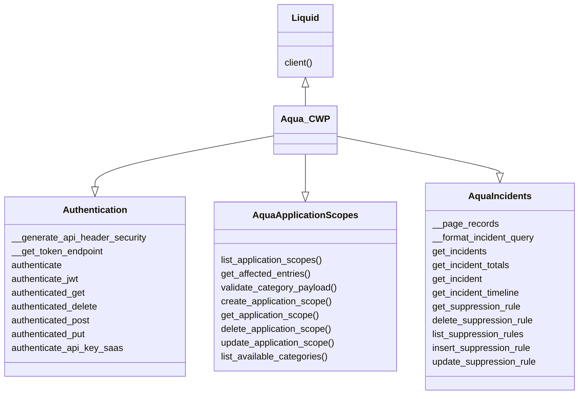

# liquid
| :warning: WARNING           |
|:----------------------------|
| This SDK is in beta and will increment quickly to add in more functionality.     |
An (unoficial) AquaSec Python SDK for automation purposes. The goal is to make working with the AquaSec API's easier and more predictable.

# How to Get Started
In AquaSec there are multiple ways to authenticate and it largely depends on the deployment model (SaaS or Local). In order to make this an all-in-one sdk we support both deployment models. Within SaaS there is two ways to authenticate, an API Key or a static (non-sso) user/password authentication.

## Local Deployment Model:
- Set the following env variables:
    - AQUA_USER
    - AQUA_PASS
    - AQUA_URL
- Then you can instantiate the client like this:
    ```
    AQUA_CLIENT = liquid.client("aqua_cwp", {"auth_options": {"ssl_verify": False}})
    ```
## Saas Deployment Model (Static User):
- Set the following env variables:
    - AQUA_USER
    - AQUA_PASS
- Then you can instantiate the client like this:
    ```
    AQUA_CLIENT = liquid.client("aqua_cwp", {"auth_options": {"ssl_verify": True}})

    ```
## Saas Deployment Model (API Key):
> [!IMPORTANT]  
> Please follow the AquaSec Documentation for creating an API Key and associating the correct priviledges to it.
- Set the following env variables:
    - AQUA_API_KEY
    - AQUA_API_SECRET
    - AQUA_CSP_ROLES (comma separated list of roles created in AQUA that the sdk client will assume i.e. "Auditor")
    - AQUA_API_ACTIONS (comma separated list of api actions i.e."get,post,delete")
- Then you can instantiate the client like this:
    ```
   AQUA_CLIENT = liquid.client(
    "aqua_cwp", {"auth_options": {"auth_type": "saas_api", "ssl_verify": True}}
    )
    ```


# UML Diagram

