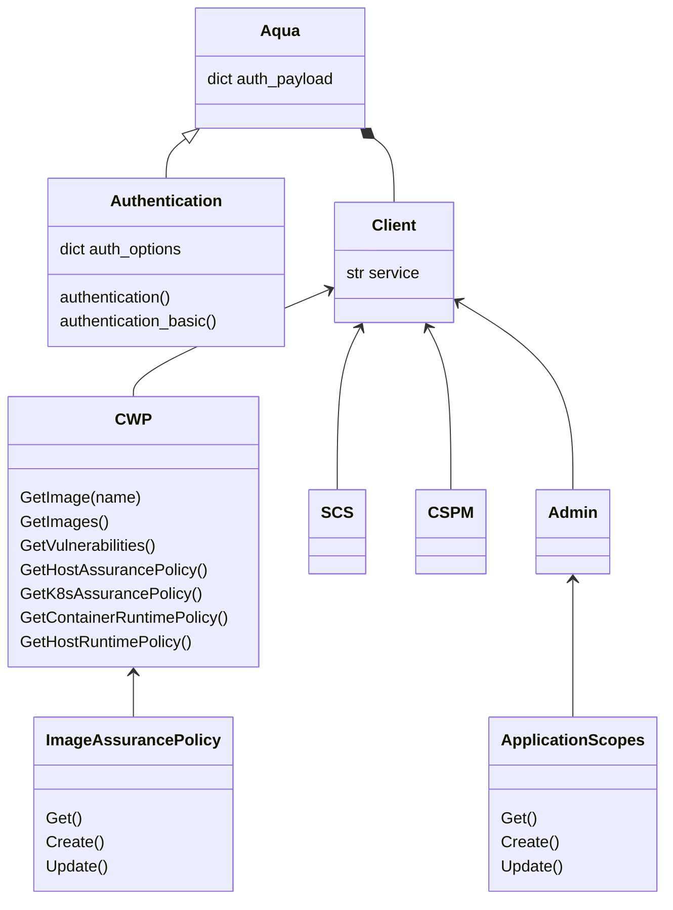

# liquid

An SDK for security tools for automation purposes.

# UML Diagram

```mermaid
classDiagram
Aqua <|-- Authentication
Aqua: dict auth_payload
Aqua *-- Client

Authentication : dict auth_options
Authentication: authentication()
Authentication: authentication_basic()

Client: str service
Client <-- CWP
Client <-- SCS
Client <-- CSPM
Client <-- Admin

CWP <-- ImageAssurancePolicy
CWP: GetImage(name)
CWP: GetImages()
CWP: GetVulnerabilities()
CWP: GetHostAssurancePolicy()
CWP: GetK8sAssurancePolicy()
CWP: GetContainerRuntimePolicy()
CWP: GetHostRuntimePolicy()

Admin <-- ApplicationScopes

ImageAssurancePolicy: Get()
ImageAssurancePolicy: Create()
ImageAssurancePolicy: Update()

ApplicationScopes: Get()
ApplicationScopes: Create()
ApplicationScopes: Update()
```